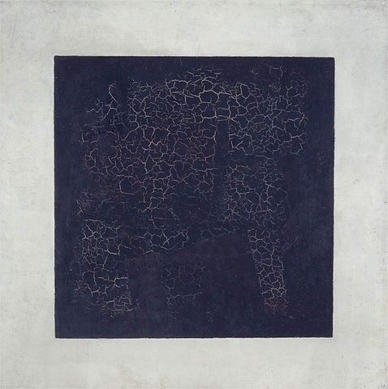
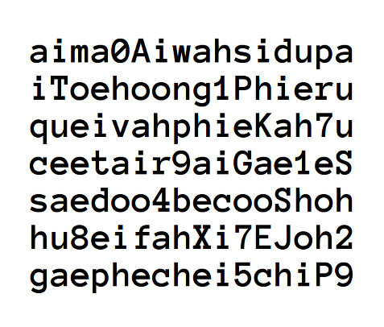

# Black Suprematic Square
## trivial web : [https://scoreboard.ctf.org.ru/task?id=31](https://scoreboard.ctf.org.ru/task?id=31)

問題ページを見ると画像が与えられている．

とりあえず，`file`コマンドや`binwalk`で中を解析してみるが何もない．

問題のカテゴリがWebだったので，画像の解析をやめて，問題ページのHTMLを解析することにしたら，
幅がない``タグがあり，そこに埋め込まれた画像を取得してみた．

画像には文字列が書かれており，`exiftool`コマンドで調べてみると，
コメントセクションに画像内に書かれているテキストがあったので，サブミットした．

## Flag: `aima0AiwahsidupaiToehoong1PhieruqueivahphieKah7uceetair9aiGae1eSsaedoo4becooShohhu8eifahXi7EJoh2gaephechei5chiP9`

