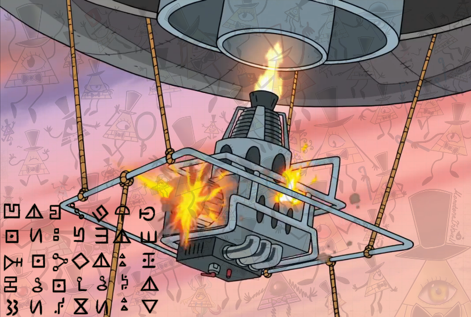

# Here goes!
## trivial crypto recon : [https://scoreboard.ctf.org.ru/task?id=21](https://scoreboard.ctf.org.ru/task?id=21)

問題文にある画像内に特殊な記号が存在する．

恐らく，この記号を解読することが，手掛かりになると推測できるため，
まずはこの記号について調べる．すると，このCTF全体を通して出てきているアニメの作品
「[Gravity Falls](http://disneyxd.disney.com/gravity-falls)」内に出てきていることがわかった．

[このサイト](http://gravityfalls.wikia.com/wiki/List_of_cryptograms#Bill.27s_symbol_substitution_cipher)を参考に，一文字ずつ換字していくと，結果フラグである文字列が得られた．

## FLAG: `FIXPROBLEMQUICKLYWITHGALVANIZEDJETS`

