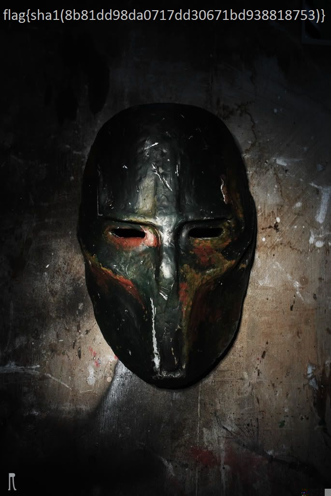

# WYGINWYS(what you get is not what you see)
Category: Forensics  
Point: 200

## Question
[http://material.wargame.whitehat.vn/contests/11/for1_206e72e52f2f73fa1a1080b70d528657.zip](http://material.wargame.whitehat.vn/contests/11/for1_206e72e52f2f73fa1a1080b70d528657.zip)

nc 118.70.80.143 7337

## FLAG
`flag{sha1(8b81dd98da0717dd30671bd938818753)}`

## Answer
問題文のURLからダウンロードしたZIPファイルを解凍する．その結果，NTFSのイメージファイルが出てきた．
まずは何も考えずに，あるディレクトリにマウントしてみると`file`というファイルがある．
中身はただのバイナリのようだ．

```bash
$ unzip for1_206e72e52f2f73fa1a1080b70d528657.zip
Archive:  for1_206e72e52f2f73fa1a1080b70d528657.zip
  inflating: image
$ file image
image: x86 boot sector, code offset 0x52, OEM-ID "NTFS    ", sectors/cluster 8, reserved sectors 0, Media descriptor 0xf8, heads 255, hidden sectors 128, dos < 4.0 BootSector (0x0)
$ mount -t ntfs image tmp/
$ ls tmp/
file
$ file tmp/file
tmp/file: data
```

次に，[The Sleuth Kit](http://www.sleuthkit.org/sleuthkit)のツールを用いてファイルシステムを解析する．

```bash
$ fls -f ntfs image
r/r 4-128-4:    $AttrDef
r/r 8-128-2:    $BadClus
r/r 8-128-1:    $BadClus:$Bad
r/r 6-128-4:    $Bitmap
r/r 7-128-1:    $Boot
d/d 11-144-4:   $Extend
r/r 2-128-1:    $LogFile
r/r 0-128-1:    $MFT
r/r 1-128-1:    $MFTMirr
r/r 9-128-8:    $Secure:$SDS
r/r 9-144-6:    $Secure:$SDH
r/r 9-144-5:    $Secure:$SII
r/r 10-128-1:   $UpCase
r/r 3-128-3:    $Volume
r/r 33-128-3:   file
-/r * 34-128-3: encrypt.pyc
d/d 256:        $OrphanFiles
```

イメージの中身を確認すると，`encrypt.pyc`という怪しげなファイルがあるので抽出する．
`fls`をした結果の第2カラムが，ファイルのi-node番号と対応しているので，その情報を使う．

```bash
$ icat image 34 > encrypt.pyc
```

この時点で，何となく，`file`というファイルは`encrypt.pyc`で暗号化されたファイルなのかなと推測出来る．
しかし，`encrypt.pyc`はコンパイルされており，そのままでは中身を見ることが出来ないため，
[uncompyler](https://github.com/gstarnberger/uncompyle)を使い，`.py`を取得する．

```bash
$ uncompyler.py encrypt.pyc > encrypt.py
```

あとは，この`encrypt.py`のソースコードを見て，暗号化のロジックを逆にして復号する．
ロジックを見ると，RSA暗号で暗号化されたことがわかる．

ソースコードを見ると，暗号化に使われた各パラメータは，次の通りであることがわかる．
```
n = 105635707994215785064592688829431603295092019332941340218063024030214112435477388955472078061967366591274439713776563251824009429910796926009945639353007371855413993984379598868696195164099879394346788069941545731813097331015058786201697958822353538490747425524617437354269664766909763679684047454688278011031
e = 65537
```

また，復号に使うの指数の値（`d`）は，Questionに書かれたサーバに接続すると降ってきた．
```
d = 88564621686225804143599949348031629074448419889036649215278253785863628513354908121326408001477927349804924920474953757949280896835049634504821293313553289355709328104008395204711274370387211439046775523078243154006826451358656526662979651456823488028759120748152472580144809988367304986290600684644152983809
```

RSA暗号に使うパラメータがわかったので，これらの値を使って`file`を復号する．

```python
# Author: @ommadawn46
import base64, os, re

SIZE_READ = 128+22

def getModule():
    nn = 'MTA1NjM1NzA'
    nn += '3OTk0MjE1Nzg1MDY0NTkyNjg4ODI5NDMxNjAzMjk1MDkyM'
    nn += 'D'
    Dantonz = 'ZnV6dQ=='
    nn += 'E5MzMyOTQxMzQwMjE4MDYzMDI0MD'
    nn += 'MwMjE0MTEyNDM1NDc3Mzg4OTU1NDcyMDc4MDYxOTY3MzY2NTkxMjc0NDM5NzE'
    nn += chr(ord('z')) + chr(ord('N'))
    jtyiel = 'Z2tkb318zz=='
    nn += 'zc2NTYzMjUxODI0MDA5NDI5'
    nn += 'OTEwNzk2OTI2MDA5OTQ1NjM5MzUzMDA3MzcxODU1NDEzOTkzOTg0Mzc5NTk4ODY4Njk2MTk1MTY0MDk5ODc5Mzk0MzQ2Nzg4MDY5OTQxNTQ1NzMxODEzMDk3MzMxMDE1MDU4Nzg2MjAxNjk3OTU4ODIyMzUzNTM4NDkwNzQ3NDI1NTI0NjE3NDM3MzU0MjY5NjY0NzY2OTA5NzYzNjc5Njg0MDQ3NDU0Njg4Mjc4MDExMDMx'
    n = base64.b64decode(nn)
    return long(n)

def readFile(name):
    contents = []
    try:
        f = open(name, 'rb')
    except IOError:
        return []
    return f.read().split("#$%&'()*+,-./:;<=>?@"+chr(0x0F)+chr(0x15))


def check_data(data):
    check = re.findall('^[0]{1,}', data)
    return len(check) / 2


contents = readFile("file")

d = 88564621686225804143599949348031629074448419889036649215278253785863628513354908121326408001477927349804924920474953757949280896835049634504821293313553289355709328104008395204711274370387211439046775523078243154006826451358656526662979651456823488028759120748152472580144809988367304986290600684644152983809
n = getModule()

wf = open("decrypted", "wb")
for c in contents:
    l = [hex(ord(b))[2:] for b in c]
    l = map(lambda x: "0"+x if len(x)==1 else x, l)
    df = long("".join(l), 16)
    h = hex(pow(df, d, n))[2:].rstrip("L")
    if len(h) % 2 == 1:
        h = '0' + h
    while len(h) < 200:
        h = '00' + h
    for a, b in zip(h[::2], h[1::2]):
        c = chr(int(a+b, 16))
        wf.write(chr(int(a+b, 16)))
wf.close()
```

このPythonスクリプトを実行すると，`decrypted`というファイルが出来る．
後は，画像閲覧ソフトで閲覧すると，フラグが書かれた画像が見える．



## Author
[asakasa](https://github.com/asakasa)
