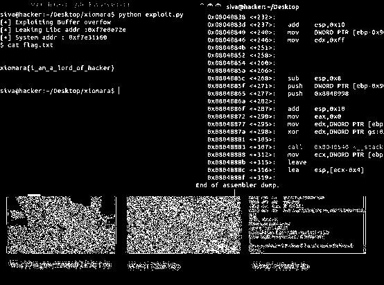

# (not) Guilty Boyfriend

Category: Forensics & Network

Point: 100

## Question

My girlfriend is out of town and I found her memory card. Time to dig in, suckaaa. 

 [ DD file ](./forensics_EF1F67AD663B2371B945A4095763405D_100.dd)

## Answer

問題のファイルをfileコマンドで調べると，NTFSディスクイメージであることが分かる．

```
$ file forensics_EF1F67AD663B2371B945A4095763405D_100.dd
forensics_EF1F67AD663B2371B945A4095763405D_100.dd: DOS/MBR boot sector, code offset 0x52+2, OEM-ID "NTFS    ", sectors/cluster 8, Media descriptor 0xf8, sectors/track 62, heads 247, hidden sectors 2048, dos < 4.0 BootSector (0x80), FAT (1Y bit by descriptor); NTFS, sectors/track 62, sectors 51199, $MFT start cluster 4, $MFTMirror start cluster 3199, bytes/RecordSegment 2^(-1*246), clusters/index block 1, serial number 05167b90917b0e504; contains Microsoft Windows XP/VISTA bootloader BOOTMGR
```


Macにて問題ファイルの拡張子を.imgに変え，ダブルクリックして中を見てみたが特に怪しいファイルは見つからない（`/nsa/passwords.txt.zip`にはパスワードが設定されていた）．


そこで，フォレンジックツールのautopsyを用いてディスクイメージを解析したところ,

`/lulz_sec/fake_flag.jpeg`と`/lulz_sec/flag.png`の二つのファイルが削除されていることがわかった．


二つの画像ファイルのExif情報などを見てみたが特に何も見つからない．

色々試している中で，[flag.png](./flag.png)をペイントツールで開き黒い部分を白く塗りつぶしてみたところ，文字のようなものが浮かび上がった．


`cat flag.txt`と書いてある下の部分が見れないので，stegsolveというツールを用いたところ，以下の画像が得られた．




## Flag

`xiomara{i_am_a_lord_of_hacker}`

